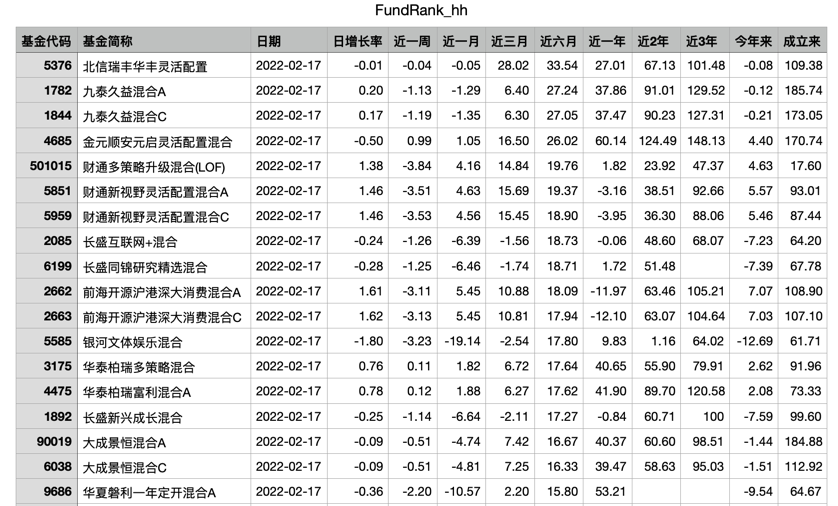
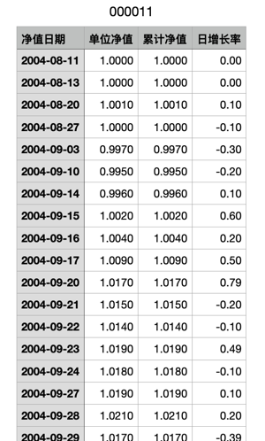

# 基金获取/分析助手
基金获取/分析助手，可以获取不同类型的基金排名与指定基金的历史数据。

## 使用说明
1. 安装依赖包
```shell
pip install -r requirements.txt
```

2. 运行 `main.py`， 获取基金排名
```python
# 获取混合型基金排名
rank = FundRank("混合") # 可传入值：混合、债券、股票、指数，默认全部基金
rank.getRank()
```

3. 运行 `main.py`，获取基金历史数据
```python
fund = SingleFund('006554')  # 基金code
fund.getDetail()
```

## 示例
默认存储路径 `./data`
### 混合基金基金排名


### 000011 基金历史数据



## TODO
- [ ] 获取基金详细信息，例如基金经理、基金规模、持仓等
- [ ] 提供可视化基金分析工具
- [ ] 每日获取关注基金/板块详情，自动发送微信信息
